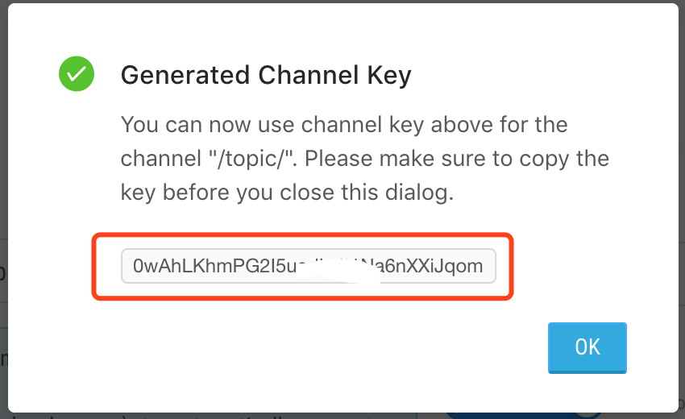

# ESPMQTT Emitter client

## Before you run this Example
- Register an account from https://emitter.io/
- Login and create channel key, grant access for the channel `/topic/` as the images bellow
- `make menuconfig` provide Wi-Fi information and CHANNEL_KEY to `MQTT Application example`
- `make flash monitor`

