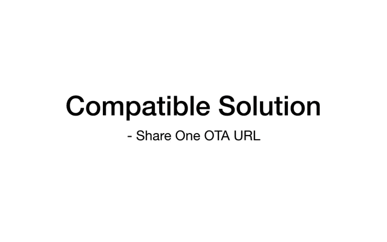

FOTA from an Old SDK to the New ESP8266 RTOS SDK (IDF Style)
*************************************************************

FOTA: firmware over the air, herein it means the firmware upgrading through Wi-Fi.  
Since the ESP8266 RTOS SDK V3.0, we refactored the SDK to be the ESP-IDF style. This document introduces the FOTA from a non-OS (or an old RTOS that earlier than V3.0) firmware to the new IDF style RTOS firmware.   
Please note that users need to make modifications to the application, because the new APIs are not compatible with the old SDKs', due to underlying changes in the architecture. 

SDK Partition Map
=================

Here are the partition maps of the old SDK and the new IDF style RTOS SDK:

1. The Old ESP8266 SDK
----------------------

+------------+------------+------------+-------------------------+
|  Boot/4KB  |    APP1    |    APP2    |  System Parameter/16KB  |
+------------+------------+------------+-------------------------+

2. The New ESP8266 SDK (IDF Style)
----------------------------------

+-------------+-----------------------+-----------+------------+------------+
|  Boot/16KB  |  Partition Table/4KB  |    NVS    |    APP1    |    APP2    |
+-------------+-----------------------+-----------+------------+------------+

In the new IDF style ESP8266 RTOS SDK SDK, each partition's base address is configurable in menuconfig, except boot's.

Firmware Compatibility
======================

To implement FOTA from an old SDK firmware to the new one, users need to download all necessary partitions of the new firmware (including new boot, new partition table, and new application), into the old one's APP partition.

Then the new bootloader will unpack the packed new firmware, and copy each partition data to the target partition address.

When FOTA completing, the partition map may look like the following graph (what will it be is based on your actual partition table):

+--------------------+-----------------+---------------------------+---------------+----------------+----------------+-------------------------+
|  old SDK Boot/4KB  |  new Boot/16KB  |  new Partition Table/4KB  |    new NVS    |    new APP1    |    new APP2    |  System Parameter/16KB  |
+--------------------+-----------------+-------------------------------------------+----------------+----------------+-------------------------+

In this case, there are about 40KB(4KB + 16KB + 4KB + 16KB) flash size cannot be used by users.

FOTA by Single Firmware URL
---------------------------

|single_ota_url|

FOTA by Multi Firmware URLs
---------------------------

|multi-ota-urls|

Workflow
========

Herein we provide an example of the FOTA.

Step 1: Connect to AP
----------------------

Connect your host PC and the ESP8266 to the same AP.

Step 2: Configure and Build
-----------------------------

Here, we use the :example:`system/ota/native_ota/1MB_flash/new_to_new_with_old` if flash is 1MB or :example:`system/ota/native_ota/2+MB_flash/new_to_new_with_old` if flash is 2MB or larger.

Open a new terminal on your PC, set the following configurations, and then compile the example:

1. Enter the target directory
^^^^^^^^^^^^^^^^^^^^^^^^^^^^^^

::

    cd $IDF_PATH/examples/system/ota

2. Enable the OTA compatibility function
^^^^^^^^^^^^^^^^^^^^^^^^^^^^^^^^^^^^^^^^

::

    Component config --->
        ESP8266-specific --->
            [*] (**Expected**)ESP8266 update from old SDK by OTA

3. ESP8285(ESP8266 + 1MB flash) configuration:
^^^^^^^^^^^^^^^^^^^^^^^^^^^^^^^^^^^^^^^^^^^^^^

Configure the flash size according to your actual development board's flash.

::

    Serial flasher config  --->
        Flash size (x MB)  ---> real flash size

4. Configure example's parameters 
^^^^^^^^^^^^^^^^^^^^^^^^^^^^^^^^^^

::

    Example Configuration --->
        (myssid) WiFi SSID
        (mypassword) WiFi Password
        (192.168.0.3) HTTP Server IP
        (8070)HTTP Server Port
        (/hello_world.ota.bin) HTTP GET Filename

- WiFi SSID: Wi-Fi SSID of router
- WiFi Password: Wi-Fi password of router
- HTTP Server IP: It may be the PC's IP address
- HTTP Server Port: HTTP server port
- HTTP GET Filename: Using "ota.ota.bin" which is the target firmware of the example

5. Select connecting to the original AP 
^^^^^^^^^^^^^^^^^^^^^^^^^^^^^^^^^^^^^^^

If users want to connect to the original AP of old SDK, then configurate as following:

::

    Example Configuration  --->
        [*] Connect to the original AP 

5. Build the project
^^^^^^^^^^^^^^^^^^^^

Input following command to start building::

    make ota

After compiling, the final firmware "ota.v2_to_v3.ota.bin" will be generated. Then users can download and update to this new firmware when running an old SDK OTA application.

- Note: The finally firmware's name mentioned above will be as "xxx.v2_to_v3.ota.bin", "xxx" is the name of your project.

4. Start HTTP Server
^^^^^^^^^^^^^^^^^^^^

::

    cd build
    python -m SimpleHTTPServer 8070

Note
====

- It will take a lot of time for the new bootloader unpacking the firmware at the first time, please wait a while.

- The terminal will print some log that shows the progress:
    - log "I (281) boot: Start unpacking V3 firmware ...", it means that bootloader starts unpacking.
    - log "Pack V3 firmware successfully and start to reboot", it means that bootloader unpacked firmware successfully.

- This "unpacking workflow" will only be executed when it is an old SDK firmware that upgrade to the new SDK firmware, for example, V2.0 upgrade to V3.1. After that, the FOTA in later versions (for example, V3.1 upgrade to later) will be the `normal FOTA workflow <https://github.com/espressif/ESP8266_RTOS_SDK/blob/master/examples/system/ota/README.md>`_.

Inheritance Data
================

Users can perfer to the source code :example_file:`system/ota/native_ota/2+MB_flash/new_to_new_with_old/main/ota_example_main.c` to check
how to load original AP's information.

See structure **old_sysconf** in the file of :component_file:`esp8266/include/internal/esp_system_internal.h` for the organization of this information.
