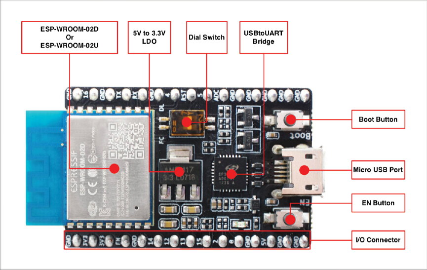
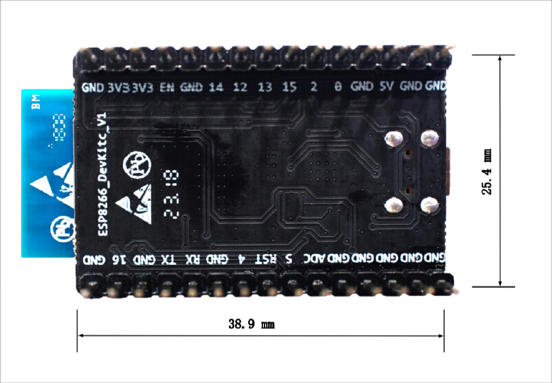

ESP8266-DevKitC Getting Started Guide
======================================

This user guide shows how to get started with ESP8266-DevKitC development board.

What You Need
-------------

* 1 × ESP8266-DevKitC board
* 1 × USB A / micro USB B cable 
* 1 × PC loaded with Windows, Linux or Mac OS

Overview
--------

ESP8266-DevKitC is a small-sized ESP8266-based development board produced by `Espressif <https://espressif.com>`_. Most of the I/O pins are broken out to the pin headers on both sides for easy interfacing. Developers can connect these pins to peripherals as needed. Standard headers also make development easy and convenient when using a breadboard. 

Functional Description
----------------------

The following list and figure below describe key components, interfaces and controls of ESP8266-DevKitC board.

ESP-WROOM-02D/U
    Module soldered to the ESP8266-DevKitC board. Optionally ESP-WROOM-02D or ESP-WROOM-02U module may be soldered.
5V to 3.3V LDO
    A LDO regulator with a maximum current output of 800 mA, which provides power supply for ESP8266 module and user’s peripherals.
Dial Switch
    A dial switch used for switching between Auto Download and Flow Control.

    * Bit1=OFF, Bit2=ON (Auto Download)
    * Bit1=ON, Bit2=OFF (Flow Control)

USB-UART Bridge
    A single chip USB-UART bridge provides up to 3 Mbps transfers rates.
Boot Button
    Download button: holding down the **Boot** button and pressing the **EN** button initiates the firmware download mode. Then user can download firmware through the serial port.
Micro USB Port
    USB interface. It functions as the power supply for the board and the communication interface between PC and the board.
EN Button
    Reset button: pressing this button resets the system.
I/O Connector
    All of the pins on the ESP8266 module are broken out to the pin headers on the board. Users can program ESP8266 to enable multiple functions.
    For details, please refer to `ESP8266EX Datasheet <https://www.espressif.com/sites/default/files/documentation/0a-esp8266ex_datasheet_en.pdf>`_ .

.. _get-started-esp8266-devkitc-board-front:

    ESP8266-DevKitC with ESP-WROOM-02D module soldered

Power Supply Options
--------------------

There following options are available to provide power supply to this board:

1. Micro USB port, this is default power supply connection
2. 5V / GND header pins
3. 3V3 / GND header pins

.. warning::

    Above options are mutually exclusive, i.e. the power supply may be provided using only one of the above options. Attempt to power the board using more than one connection at a time may damage the board and/or the power supply source.

Start Application Development
------------------------------

Before powering up the ESP8266-DevKitC, please make sure that the board has been received in good condition with no obvious signs of damage.

To start development of applications, you may walk through the following steps:

* setup toolchain in your PC to develop applications for ESP8266 in C language
* connect the module to the PC and verify if it is accessible
* build an example application to the ESP8266
* monitor instantly what the application is doing

Board Dimensions
----------------

    ESP8266 DevKitC board dimensions - back

Related Documents
-----------------

* `ESP-WROOM-02 PCB Design and Module Placement Guide <http://espressif.com/en/support/download/documents?keys=ESP-WROOM-02+PCB+Design+and+Module+Placement+Guide>`_ (WEB)
* `ESP8266 Hardware Resources <http://espressif.com/en/support/download/documents?keys=reference+design>`_ (WEB)
* `ESP8266 App <http://espressif.com/en/support/download/apps>`_ (WEB)
* `ESP8266 BBS <http://bbs.espressif.com>`_ (WEB)
* `ESP8266 Resources <http://www.espressif.com/en/products/hardware/esp8266ex/resources>`_ (WEB)
