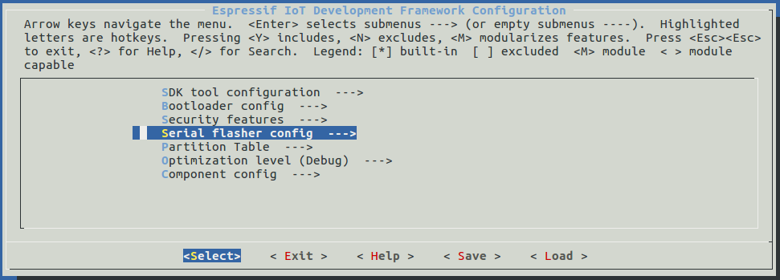

***********
Get Started
***********

This document is intended to help users set up the software environment for development of applications using hardware based on the Espressif ESP8266EX. Through a simple example we would like to illustrate how to use ESP8266\_RTOS\_SDK (ESP-IDF Style), including the menu based configuration, compiling the ESP8266\_RTOS\_SDK and firmware download to ESP8266EX boards. 

Introduction
============

The ESP8266EX microcontroller integrates a Tensilica L106 32-bit RISC processor, which achieves extra-low power consumption and reaches a maximum clock speed of 160 MHz. The Real-Time Operating System (RTOS) and Wi-Fi stack allow about 80% of the processing power to be available for user application programming and development.

Espressif provides the basic hardware and software resources that help application developers to build their ideas around the ESP8266EX series hardware. The software development framework by Espressif is intended for rapidly developing Internet-of-Things (IoT) applications, with Wi-Fi, power management and several other system features. 

What You Need
=============

To develop applications for ESP8266EX you need:

* **PC** loaded with either Windows, Linux or Mac operating system
* **Toolchain** to build the **Application** for ESP8266EX
* **ESP8266\_RTOS\_SDK** that essentially contains API for ESP8266EX and scripts to operate the **Toolchain**
* A text editor to write programs (**Projects**) in C, e.g. `Eclipse <https://www.eclipse.org/>`_
* The **ESP8266EX** board itself and a **USB cable** to connect it to the **PC**

.. figure:: ../../_static/what-you-need.png
    :align: center
    :alt: Development of applications for ESP8266EX
    :figclass: align-center

    Development of applications for ESP8266EX

Preparation of development environment consists of three steps:

1. Setup of **Toolchain**
2. Getting of **ESP8266\_RTOS\_SDK** from GitHub
3. Installation and configuration of **Eclipse**

You may skip the last step, if you prefer to use different editor.

Having environment set up, you are ready to start the most interesting part - the application development. This process may be summarized in four steps:

1. Configuration of a **Project** and writing the code
2. Compilation of the **Project** and linking it to build an **Application**
3. Flashing (uploading) of the **Application** to **ESP8266EX**
4. Monitoring / debugging of the **Application**

See instructions below that will walk you through these steps.

Guides
======

If you have one of ESP8266 development boards listed below, click on provided links to get you up and running.

.. toctree::
    :maxdepth: 1

    ESP8266 DevKitC <get-started-devkitc>

If you have different board, move to sections below.

.. _get-started-setup-toolchain:

Setup Toolchain
===============

The quickest way to start development with ESP8266EX is by installing a prebuilt toolchain. Pick up your OS below and follow provided instructions. 

.. toctree::
    :hidden:

    Windows <windows-setup>
    Linux <linux-setup> 
    MacOS <macos-setup> 

+-------------------+-------------------+-------------------+
| |windows-logo|    | |linux-logo|      | |macos-logo|      |
+-------------------+-------------------+-------------------+
| `Windows`_        | `Linux`_          | `Mac OS`_         |
+-------------------+-------------------+-------------------+

.. |windows-logo| image:: ../../_static/windows-logo.png
    :target: ../get-started/windows-setup.html

.. |linux-logo| image:: ../../_static/linux-logo.png
    :target: ../get-started/linux-setup.html

.. |macos-logo| image:: ../../_static/macos-logo.png
    :target: ../get-started/macos-setup.html

.. _Windows: ../get-started/windows-setup.html
.. _Linux: ../get-started/linux-setup.html
.. _Mac OS: ../get-started/macos-setup.html

.. note::

    We are using ``~/esp`` directory to install the prebuilt toolchain, ESP8266_RTOS_SDK and sample applications. You can use different directory, but need to adjust respective commands.

Depending on your experience and preferences, instead of using a prebuilt toolchain, you may want to customize your environment..

Once you are done with setting up the toolchain then go to section :ref:`get-started-get-esp-idf`.

.. _get-started-get-esp-idf:

Get ESP8266\_RTOS\_SDK
======================

.. highlight:: bash

Besides the toolchain (that contains programs to compile and build the application), you also need ESP8266 specific API / libraries. They are provided by Espressif in `ESP8266_RTOS_SDK repository <https://github.com/espressif/ESP8266_RTOS_SDK>`_.

.. include:: /_build/inc/git-clone.inc

.. _get-started-setup-path:

Setup Path to ESP8266\_RTOS\_SDK
================================

The toolchain programs access ESP8266\_RTOS\_SDK using ``IDF_PATH`` environment variable. This variable should be set up on your PC, otherwise projects will not build. Setting may be done manually, each time PC is restarted. Another option is to set up it permanently by defining ``IDF_PATH`` in user profile.

.. _get-started-get-packages:

Install the Required Python Packages
====================================

Python packages required by ESP8266\_RTOS\_SDK are located in the ``$IDF_PATH/requirements.txt`` file. You can install them by running::

    python -m pip install --user -r $IDF_PATH/requirements.txt

.. note::

    Please invoke that version of the Python interpreter which you will be using with ESP8266_RTOS_SDK. The version of the
    interpreter can be checked by running command ``python --version`` and depending on the result, you might want to
    use ``python2``, ``python2.7`` or similar instead of ``python``, e.g.::

        python2.7 -m pip install --user -r $IDF_PATH/requirements.txt

.. _get-started-start-project:

Start a Project
===============

Now you are ready to prepare your application for ESP8266. To start off quickly, we will use :example:`get-started/hello_world` project from :idf:`examples` directory in IDF.

Copy :example:`get-started/hello_world` to ``~/esp`` directory::

    cd ~/esp
    cp -r $IDF_PATH/examples/get-started/hello_world .

You can also find a range of example projects under the :idf:`examples` directory in ESP-IDF. These example project directories can be copied in the same way as presented above, to begin your own projects.

.. important::

    The ESP8266_RTOS_SDK build system does not support spaces in paths to ESP8266_RTOS_SDK or to projects.

.. _get-started-connect:

Connect
=======

You are almost there. To be able to proceed further, connect ESP8266 board to PC, check under what serial port the board is visible and verify if serial communication works. Note the port number, as it will be required in the next step.

.. _get-started-configure:

Configure
=========

Being in terminal window, go to directory of ``hello_world`` application by typing ``cd ~/esp/hello_world``. Then start project configuration utility ``menuconfig``::

    cd ~/esp/hello_world
    make menuconfig

If previous steps have been done correctly, the following menu will be displayed: 

    Project configuration - Home window

In the menu, navigate to ``Serial flasher config`` > ``Default serial port`` to configure the serial port, where project will be loaded to. Confirm selection by pressing enter, save configuration by selecting ``< Save >`` and then exit application by selecting ``< Exit >``.

.. note::

   On Windows, serial ports have names like COM1. On MacOS, they start with ``/dev/cu.``. On Linux, they start with ``/dev/tty``.

Here are couple of tips on navigation and use of ``menuconfig``:

* Use up & down arrow keys to navigate the menu.
* Use Enter key to go into a submenu, Escape key to go out or to exit.
* Type ``?`` to see a help screen. Enter key exits the help screen.
* Use Space key, or ``Y`` and ``N`` keys to enable (Yes) and disable (No) configuration items with checkboxes "``[*]``"
* Pressing ``?`` while highlighting a configuration item displays help about that item.
* Type ``/`` to search the configuration items.

.. note::

    If you are **Arch Linux** user, navigate to ``SDK tool configuration`` and change the name of ``Python 2 interpreter`` from ``python`` to ``python2``.

.. _get-started-build-flash:

Build and Flash
===============

Now you can build and flash the application. Run::

    make flash

This will compile the application and all the ESP8266\_RTOS\_SDK components, generate bootloader, partition table, and application binaries, and flash these binaries to your ESP8266 board.

.. highlight:: none

::

    esptool.py v2.4.0
    Flashing binaries to serial port /dev/ttyUSB0 (app at offset 0x10000)...
    esptool.py v2.4.0
    Connecting....
    Chip is ESP8266EX
    Features: WiFi
    MAC: ec:fa:bc:1d:33:2d
    Uploading stub...
    Running stub...
    Stub running...
    Configuring flash size...
    Compressed 7952 bytes to 5488...
    Wrote 7952 bytes (5488 compressed) at 0x00000000 in 0.5 seconds (effective 129.9 kbit/s)...
    Hash of data verified.
    Compressed 234800 bytes to 162889...
    Wrote 234800 bytes (162889 compressed) at 0x00010000 in 14.4 seconds (effective 130.6 kbit/s)...
    Hash of data verified.
    Compressed 3072 bytes to 83...
    Wrote 3072 bytes (83 compressed) at 0x00008000 in 0.0 seconds (effective 1789.8 kbit/s)...
    Hash of data verified.

    Leaving...
    Hard resetting via RTS pin...

If there are no issues, at the end of build process, you should see messages describing progress of loading process. Finally, the end module will be reset and "hello_world" application will start.

If you'd like to use the Eclipse IDE instead of running ``make``, check out the :doc:`Eclipse guide <eclipse-setup>`.

.. _get-started-build-monitor:

Monitor
=======

To see if "hello_world" application is indeed running, type ``make monitor``.

    $ make monitor
    MONITOR
    --- idf_monitor on /dev/ttyUSB0 74880 ---
    --- Quit: Ctrl+] | Menu: Ctrl+T | Help: Ctrl+T followed by Ctrl+H ---

    ets Jan  8 2013,rst cause:1, boot mode:(3,6)

    load 0x40100000, len 4400, room 16 
    0x40100000: _stext at ??:?

    tail 0
    chksum 0x6f
    load 0x3ffe8408, len 3516, room 8 
    tail 4
    chksum 0x5d
    ...

Several lines below, after start up and diagnostic log, you should see "SDK version: xxxxxxx" printed out by the application. ::

    ...
    SDK version:v3.1-dev-311-g824cd8c8-dirty

To exit the monitor use shortcut ``Ctrl+]``. 

.. note::

    If instead of the messages above, you see a random garbage similar to::

        e���)(Xn@�y.!��(�PW+)��Hn9a؅/9�!�t5��P�~�k��e�ea�5�jA
        ~zY��Y(1�,1�� e���)(Xn@�y.!Dr�zY(�jpi�|�+z5Ymvp

To execute ``make flash`` and ``make monitor`` in one go, type ``make flash monitor``.

That's all what you need to get started with ESP8266! 

Now you are ready to try some other :idf:`examples`, or go right to developing your own applications.

Environment Variables
=====================

Some environment variables can be specified whilst calling ``make`` allowing users to **override arguments without needing to reconfigure them using** ``make menuconfig``.

+-----------------+--------------------------------------------------------------+
| Variables       | Description & Usage                                          |
+=================+==============================================================+
| ``ESPPORT``     | Overrides the serial port used in ``flash`` and ``monitor``. |
|                 |                                                              |
|                 | Examples: ``make flash ESPPORT=/dev/ttyUSB1``,               |
|                 | ``make monitor ESPPORT=COM1``                                |
+-----------------+--------------------------------------------------------------+
| ``ESPBAUD``     | Overrides the serial baud rate when flashing the ESP32.      |
|                 |                                                              |
|                 | Example: ``make flash ESPBAUD=9600``                         |
+-----------------+--------------------------------------------------------------+
| ``MONITORBAUD`` | Overrides the serial baud rate used when monitoring.         |
|                 |                                                              |
|                 | Example: ``make monitor MONITORBAUD=9600``                   |
+-----------------+--------------------------------------------------------------+

.. note::
    Users can export environment variables (e.g. ``export ESPPORT=/dev/ttyUSB1``).
    All subsequent calls of ``make`` within the same terminal session will use 
    the exported value given that the variable is not simultaneously overridden.

Related Documents
=================

.. toctree::
    :maxdepth: 1

    eclipse-setup

.. _Stable version: https://github.com/espressif/ESP8266_RTOS_SDK/tree/master/docs/en
.. _Releases page: https://github.com/espressif/ESP8266_RTOS_SDK/releases

