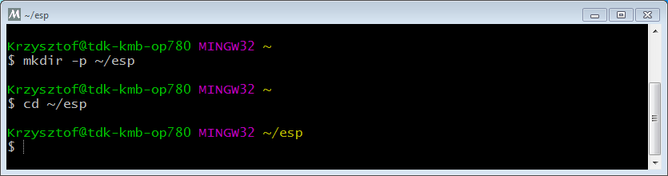

***************************************
Standard Setup of Toolchain for Windows
***************************************

Introduction
============

Windows doesn't have a built-in "make" environment, so as well as installing the toolchain you will need a GNU-compatible environment. We use the MSYS2_ environment to provide this. You don't need to use this environment all the time (you can use :doc:`Eclipse <eclipse-setup>` or some other front-end), but it runs behind the scenes.

Toolchain Setup 
===============

The quick setup is to download the Windows all-in-one toolchain & MSYS2 zip file from dl.espressif.com:

https://dl.espressif.com/dl/esp32_win32_msys2_environment_and_toolchain-20181001.zip

Unzip the zip file to ``C:\`` (or some other location, but this guide assumes ``C:\``) and it will create an ``msys32`` directory with a pre-prepared environment.

Download the toolchain for the ESP8266
--------------------------------------

v5.2.0

    https://dl.espressif.com/dl/xtensa-lx106-elf-win32-1.22.0-100-ge567ec7-5.2.0.zip

If you are still using old version SDK(< 3.0), please use toolchain v4.8.5, as following:

    https://dl.espressif.com/dl/xtensa-lx106-elf-win32-1.22.0-88-gde0bdc1-4.8.5.tar.gz

Check it Out
============

Open a MSYS2 MINGW32 terminal window by running ``C:\msys32\mingw32.exe``. The environment in this window is a bash shell. Create a directory named ``esp`` that is a default location to develop ESP8266 applications. To do so, run the following shell command::

    mkdir -p ~/esp

By typing ``cd ~/esp`` you can then move to the newly created directory. If there are no error messages you are done with this step.

    MSYS2 MINGW32 shell window

Use this window in the following steps setting up development environment for ESP8266.

Next Steps
==========

To carry on with development environment setup, proceed to section :ref:`get-started-get-esp-idf`.

Related Documents
=================

.. _MSYS2: https://msys2.github.io/
