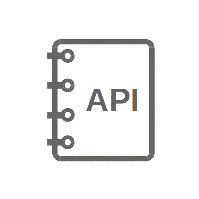

ESP8266\_RTOS\_SDK (IDF Style) Programming Guide
================================================

This is the documentation for the new `ESP8266_RTOS_SDK <https://github.com/espressif/ESP8266_RTOS_SDK>`_ which refactored to be ESP-IDF Style. ESP8266\_RTOS\_SDK is the official development framework for the `ESP8266EX <https://www.espressif.com/en/products/hardware/esp8266ex/overview>`_ chip.

==================  ==================  ==================  ==================
|Get Started|_      |API Reference|_    |API Guides|_       |General Notes|_
------------------  ------------------  ------------------  ------------------
`Get Started`_      `API Reference`_    `API Guides`_       `General Notes`_
==================  ==================  ==================  ==================

.. |Get Started| image:: ../_static/get-started.gif
.. _Get Started: get-started/index.html

.. _API Reference: api-reference/index.html

.. |API Guides| image:: ../_static/api-guides.gif
.. _API Guides: api-guides/index.html

.. _General Notes: general-notes/index.html

.. toctree::
   :hidden:

   Get Started <get-started/index>
   API Reference <api-reference/index>
   API Guides <api-guides/index>
   General Notes <general-notes/index>
   
* :ref:`genindex`
