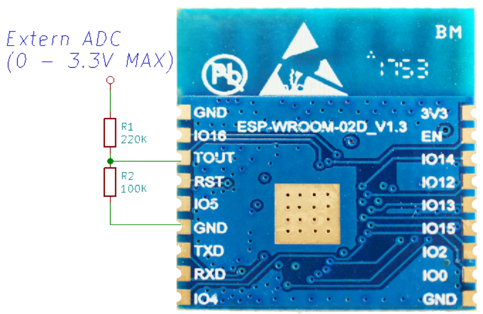

# _ADC Example_

_This is a example for reading ADC values._

1. An analog-to-digital converter (ADC) is used to convert analog signals into digital forms. ESP8266 has a built-in 10-bit ADC, only one ADC channel.

2. ADC channel in ESP8266 is multiplexed with system voltage. Therefore, we can set it to measure system voltage or external voltage. When reading the external voltage, the input voltage range of TOUT(ADC) pin are 0-1.0V.

3. ` menuconfig - > Component config - > PHY - > vdd33_const value ` provides the setting of ADC mode, that is, whether the system voltage or external voltage is being measured.

4. ` Menuconfig - > Component config - > PHY - > vdd33_const value ` must be set to 255 to read the system voltage, that is, the voltage on the VDD pin of ESP8266. To read the external voltage on TOUT(ADC) pin, vdd33_const need less than 255
When the ADC reference voltage is set to the actual VDD33 power supply voltage, the value range of vdd33_const is [18,36], the unit is 0.1V.
When the ADC reference voltage is set to the default value of 3.3V as the supply voltage, the range of vdd33_const is [0, 18] or (36, 255).

## How to use example

### Hardware Required

1. To support external voltage range (0-3.3V), connect TOUT(ADC) pin to resistance divider network (R1 220K and R2 100K)

  

2. When measuring VDD pin voltage, the TOUT(ADC) pin must be left floating. At this point, resistance divider networks R1, R2 need to be removed.

### Configure the project

```
make menuconfig
```

* Set serial port under Serial Flasher Options.  
* `make monitor` baud rate set to what you set in the example.
* Modify `menuconfig->Component config->PHY->vdd33_const value`, vdd33_const provides ADC mode settings

### Build and Flash

Build the project and flash it to the board, then run monitor tool to view serial output:

```
make -j4 flash monitor
```

(To exit the serial monitor, type ``Ctrl-]``.)

See the Getting Started Guide for full steps to configure and use ESP-IDF to build projects.

## Example Output  

```
I (482) adc example: adc read: 29

I (482) adc example: adc read fast:

29
29
30
29
29
29
29
29
29
29
29
29
29
29
29
```