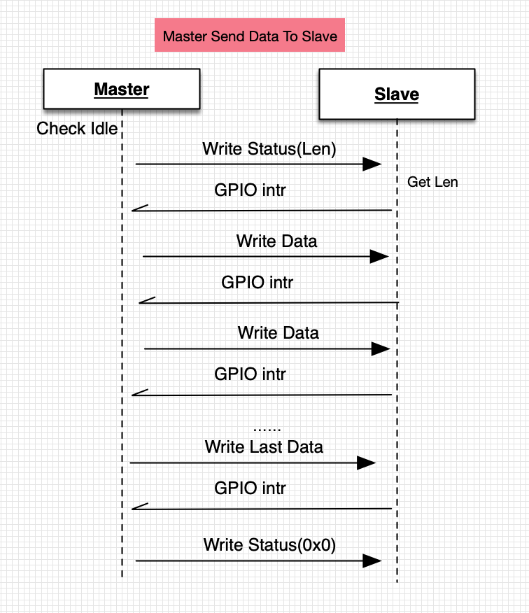
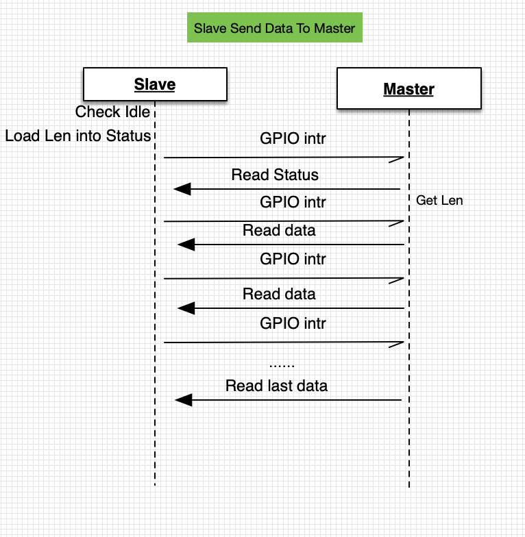
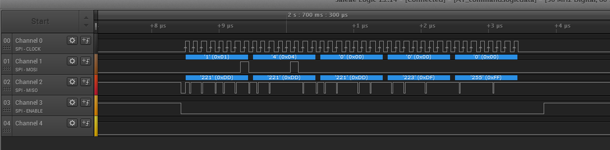
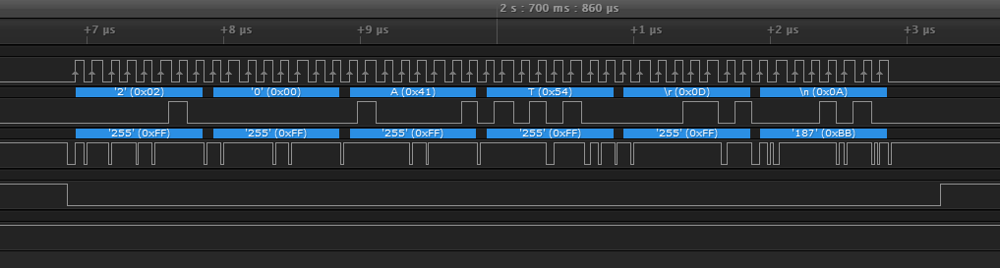
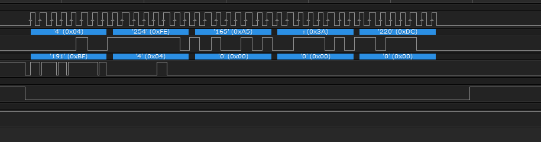

## SPI Demo User Guide

### Overview

Since the ESP8266 does not have DMA, it can only transmit 64 bytes per time at most. There are two demos of ESP8266 SPI driver, normal_performance and high_performance.

* normal_performance demo is for the normal SPI speed use case. It provides SPI slave APIs, so users can implement the ESP8266 running as SPI slave easily. But in this demo, the software schedules between task and interrupt when SPI sending/receiving data, so it is a normal speed demo.
* high_performance demo is for the high SPI speed use case. In order to rise SPI speed, ESP8266 SPI slave sends/receives data in the interrupt. It is suggested that host MCU (SPI master) also handles SPI transmission in the interrupt, otherwise the SPI transmission speed will be decreased due to software scheduling.

Both normal_performance and high_performance demo are for the SPI slave, user can implement one program of host MCU to communicate with those two demos.

### Hardware Connection

| Signal    | Slave  | Master |
| --------- | ------ | ------ |
| SCLK      | GPIO14 | GPIO14 |
| MISO      | GPIO12 | GPIO12 |
| MOSI      | GPIO13 | GPIO13 |
| CS        | GPIO15 | GPIO15 |
| HANDSHARK | GPIO4  | GPIO4  |
| GND       | GND    | GND    |

**Note:**  

* To run the firmware stored in flash, the GPIO15 needs to be low level when the ESP8266 starts up. So the power-on sequence can be `Master OFF -> Slave ON -> Master ON`.


# Software Introduction
### SPI Transmission Command

Master communicates with the ESP8266 SPI AT in half-duplex mode. The command that master uses to communicates with the ESP8266 SPI AT is in the following format.

|        | Command（1byte）| Address（1byte） | Data（64byte） |
| :----: | :-----------: | :---------------: | :-----------: |
| Read Data |    0x3     | 0x0             | Actual length   |
| Write Data |    0x2    | 0x0           | Actual length     |

Since the ESP8266 does not have SPI DMA, it can only transmit up to 64 bytes per time.

Except the above read/write data commands, ESP8266 also has two 32bit status registers that the SPI master can access: one can be wrote by master and read by ESP8266, the other can be read by master and wrote by ESP8266. In this case, the master can transmit the data length information with these two 32bit status registers. 

|          | Command（1byte） | Data（4byte）           |
| :------: | :-----------: | --------------------------- |
| Read Status |    0x4     | Length of data that master read from ESP8266|
| Write Status |    0x1    | Length of data that master transmit to ESP8266 |

**Note: When SPI master reads/writes status, it needs not to use the address bit.** So, the SPI master needs to implement read/write status and read/write data seperately.


### Master Sends Data to ESP8266

The work flow of master transmiting data to the ESP8266 (SPI slave) is as the following figure.



1. Since there will be a conflict if both master and slave transmit data to each other at the same time. So, before the master transmiting data, it will check if the ESP8266 is transmitting data now. If it is, then the master will wait until the ESP8266's transmission completed.
2. The master writes the data length to the status register, indicates the length of data that it is going to transmit.
3. The ESP8266 will generate a WR\_STA_DONE interrupt, and pull up the GPIO\_HANDSHAKE pin to inform the master that it has got the data length information.
4. The master can send up to 64 bytes per time. If data is longer than 64 bytes, then it needs to be divided to several subpackets to send.
5. ESP8266 will store the received data into the SPI register, and generate a WR\_BUF\_DONE interrupt, and then pull up the GPIO\_HANDSHAKE pin to inform the master that it has received the previous data and the master can start the next transmission now. 
6. The master has to wait for the interrupt of GPIO\_HANDSHAKE pin, which means ESP8266 received the data successfully, to start the next transmission. 
7. After sent data, the master will check the software buffer to see if there is more data wait for sending. 
  * If there is, then the master will repeat the procedure starts from step 2. 
  * If there is not, then the master needs to write 0 to the status register, indicates that data sending completed. When ESP8266 reads the status 0, the ESP8266 stops pulling up the GPIO\_HANDSHAKE pin.

### ESP8266 Sends Data to Master



1. Before ESP8266 sends data, it will check if the master is sending data now. If it is, then the ESP8266 will wait until the master's transmission completed.
2. The ESP8266 copies data into a software buffer, writes the data length to the rd_status, and then pulls up the GPIO\_HANDSHAKE pin to inform the master to read data. 
3. Master reads the data length from the status register, and generates a RD\_STA_DONE interrupt.  
4. When ESP8266 gets the RD\_STA_DONE interrupt, it will read 64 bytes from the software buffer and write those 64 bytes to the SPI register, and then pull up the GPIO\_HANDSHAKE pin to inform the master to read data. 
5. When the master gets the interrupt, it will read data through SPI.
6. ESP8266 generates RD\_BUF_DONE interrupt, and reads data (64 bytes at most) from the software buffer and write those data to the SPI register again, and then pull up the GPIO\_HANDSHAKE pin to inform the master to read data.  
7. Repeat above steps until the software buffer is empty. When all data in software buffer sent, the ESP8266 will not pull up the master, but set the rd_status to be 0 instead.

**Note:**  

 * The streambuffer of ESP8266 and the ringbuffer of ESP32 are the software buffer to keep SPI data. If the SPI master is based on FreeRTOS, then it is suggested to use the FreeRTOS-provided streambuffer(which only available since FreeRTOS v10.01 and later versions).

### HANDSHAKE Pin Introduction

HANDSHAKE pin is to indicate the transmission completes, and it can be used to the transmission that starts by ESP8266(slave).

1. When ESP8266 is ready to receive/send data, it will pull up the HANDSHAKE pin. Then the SPI master will read data from ESP8266 when it gets the interrupt.
2. After SPI master sent data, the master will block procedure to wait the HANDSHAKE pin interrupt. When ESP8266 read the data from SPI register, the ESP8266 will pull up the HANDSHAKE pin to inform the master to transmit next packet.

### Test Result of SPI Communication Speed
One ESP8266 runs as the SPI master, another ESP8266 runs as the SPI slave, both of them are running in 160MHz and send 64 bytes per time.  
The throughput test result of high_performance demo is as the following figure.
  
| SPI Clock | master -> slave | slave -> master |  
| --------- | --------------- | --------------- |  
| 20M       | 1.33MB/s        | 1.31MB/s        |  
| 16M       | 1.17MB/s        | 1.13MB/s        |  
| 10M       | 861KB/s         | 845KB/s         |  

The throughput test result of normal_performance demo is as the following figure.

| SPI  Clock | master -> slave | slave -> master |
| --------- | --------------- | --------------- |
| 20M       | 645KB/s         | 450KB/s         |
| 16M       | 606KB/s         | 430KB/s         |
| 10M       | 510KB/s         | 378KB/s         |

### Capture Packets
This is an example of SPI master sending “AT\r\n” and the ESP8266(slave) responding “AT\r\n”. The channel0 is SCLK, channel1 is MOSI, channel2 is MISO, channel3 is CS, channel4 is handshake pin.

- SPI\_MASTER\_WRITE\_STATUS\_TO\_SLAVE



Master sends command of data length, 0x01. And then the master sends the data length, 4. Handshake pin is low level in the initialization.

- SPI\_MASTER\_WRITE\_DATA\_TO_SLAVE



Master sends command of writing data, 0x02, following with 8bit address, 0x0. And then the master sends the 4bytes data. Handshake pin is high level during the communication.

- SPI\_MASTER\_READ\_STATUS\_FROM_SLAVE



Master sends command of reading data length, 0x04. The slave will respond the data length, 4. Handshake pin is high level during the communication.

- SPI\_MASTER\_READ\_DATA\_FROM\_SLAVE


Master sends command of reading data, 0x02, following with 8bit address, 0x0. And then the slave will respond the data that needs to be transmitted.

## SPI demo 使用说明

### 简介

受限于 ESP8266 没有 DMA，并且每次只能传输最大 64bytes，我们使用了两个项目（normal_performance 和 high_performance）来表述 ESP8266 SPI 驱动的用法，

其中 normal_performance 针对 SPI 速率要求不高的项目，我们封装了 SPI slave 的接口，在开发 ESP8266 作为slave 的项目时，只需要简单的接口调用即可使用，因为每次 SPI 收发均需要中断与 task 之间来回调度，因此速率较低。

high_performance 针对 SPI 速率要求高的场景，ESP8266 SPI slave 的收发均在中断中操作，为了尽可能提高传输速率， MCU 最好同样在中断中处理 SPI 传输，否则速率会因为频繁切换 task 而骤降。

两者的区别主要在 SPI slave 侧，对于 MCU 可以使用同一套程序。

### 硬件连接

- 接线:

| Signal    | Slave  | Master |
| --------- | ------ | ------ |
| SCLK      | GPIO14 | GPIO14 |
| MISO      | GPIO12 | GPIO12 |
| MOSI      | GPIO13 | GPIO13 |
| CS        | GPIO15 | GPIO15 |
| HANDSHARK | GPIO4  | GPIO4  |
| GND       | GND    | GND    |

- 注意:

在 ESP8266 上电后，需要保证一开机 GPIO15 处于低电平才能进入 flash 模式，所以开机顺序需要如下：

```
Master OFF -> Slave ON -> Master ON
```

# 软件介绍

### SPI 通信命令

MCU 在与 ESP8266 通信时采用半双工模式， MCU 通过使用不同的命令表示读数据或者写数据。数据格式如下所示：

|        | 命令（1byte） | 地址（1byte） | 数据长度（64byte） |
| :----: | :-----------: | ------------- | ------------------ |
| 读数据 |      0x3      | 0x0           | 实际长度           |
| 写数据 |      0x2      | 0x0           | 实际长度           |

ESP8266 没有 SPI DMA， 所以一次最多只能传输 64 个字节。

除了收发数据命令之外，ESP8266 有两个 MCU 可访问的 32bit 寄存器（status）， 其中一个 MCU 可写，而 ESP8266只可读，另外一个则与之相反。MCU 通过读写这两个 status 寄存器，以此实现传递数据长度信息。通信格式如下所示：

|          | 命令（1byte） | 数据长度（4byte）           |
| :------: | :-----------: | --------------------------- |
| 读status |      0x4      | MCU 读取 ESP8266 传输的长度 |
| 写status |      0x1      | MCU 可写需要传输的长度      |

需要注意的是，**MCU 读写 status 不需要使用地址位**，因此在 MCU 开发中需要将读写 status 与读写数据区分开。

### MCU 发送数据给 ESP8266

MCU 主动发送的流程如下：


1. MCU 如果有数据需要发送，首先需要检测  ESP8266 是否正在发送数据（避免同时发送），MCU 需要等待 ESP8266 发送完毕才能传输
2. MCU 首先需要向 status 里面写入本次需要发送的数据长度
3. ESP8266 会产生 WR_STA_DONE 中断， ESP8266 会拉高管脚通知 MCU 已经获取到需要接收的数据长度
4. MCU 可以一次发送最多 64bytes 的数据，如果数据超过 64bytes，需分多次发送
5. ESP8266 接收导数据后， 会存储到 SPI 寄存器，并产生 WR_BUF_DONE 中断，ESP8266 会拉管脚通知 MCU 数据已经取出，可以继续发送
6. MCU 必须等待 ESP8266 接收到数据产生的 GPIO 中断 （一次有效数据传输），之后才能继续传输
7. 发送完数据之后 MCU 需要再查询发送的软件 buffer 是否还存在数据，如果存在数据，从第 2 步继续开始，否则需要额外再向 status 写入 0 ， 以此来标明发送完毕， ESP8266 收到写入 status 0 后不再拉管脚

### ESP8266 发送数据给 MCU

ESP8266 发送的流程与 MCU 发送的流程基本类似：


1. ESP8266 如果有数据需要发送，首先需要检测 MCU 是否正在发送数据，ESP8266 需要等待 MCU 发送完毕
2. ESP8266 会将数据全部拷贝到软件 buffer 中，并向 rd_status 中写入本次需要发送的数据长度，然后拉管脚通知 MCU 取数据
3. MCU 读取 status 中的数据长度信息，读取 status 会产生 RD_STA_DONE 中断
4. ESP8266 在  RD_STA_DONE 中断中会读取软件 buffer 中的 64个字节到 SPI 寄存器，拉管脚通知 MCU 读取数据
5. MCU 在接收到 GPIO 中断后会发起一次 SPI 读数据传输
6. ESP8266 产生 RD_BUF_DONE 中断，并从软件 buffer 中再读取最大 64 个字节的数据填充到 SPI 寄存器，并拉管脚通知 MCU 读取
7. 如此循环，直到软件 buffer 中不再有数据，此时 ESP8266 不会再拉管脚通知 MCU，并且 ESP8266 会把 rd_status 置为0，读取完成

*备注：* ESP8266 所使用的  streambuffer 以及 ESP32 所使用的 ringbuffer 功能一致，用于数据的缓冲，对于 FreeRTOS 的 MCU，建议使用 FreeRTOS 自带的 streambuffer （需要 FreeRTOS 系统版本在 10.01及以上）

### Handshake 线在 SPI-AT 中的作用

Handshake 线在 SPI 相互通信中需要保证传输数据完成，并担任 ESP8266 主动发起传输的任务，其主要作用体现在如下两点：

1. ESP8266 在准备好接收/发送数据时将此针脚拉高，此时 MCU 会产生一个 GPIO 中断信号，MCU 在接收到中断信号后会读取 ESP8266 中的数据。
2. MCU 在发送完数据之后需要堵塞等待 GPIO 中断信号，ESP8266 在将 SPI 寄存器中的数据取出后会拉高管脚，从而 MCU 会产生 GPIO 中断，之后 MCU 可以继续传输

### 测试速率

一个 ESP8266 作为 MCU 充当 SPI master， 另一个 ESP8266 作为 SPI slave，两者 CPU 同时跑在 160M ， 每次发送 64bytes。

使用 high performance demo， 测试吞吐率结果如下：

| SPI  时钟 | master -> slave | slave -> master |
| --------- | --------------- | --------------- |
| 20M       | 1.33MB/s        | 1.31MB/s        |
| 16M       | 1.17MB/s        | 1.13MB/s        |
| 10M       | 861KB/s         | 845KB/s         |

使用 normal performance demo， 测试吞吐率结果如下：

| SPI  时钟 | master -> slave | slave -> master |
| --------- | --------------- | --------------- |
| 20M       | 645KB/s         | 450KB/s         |
| 16M       | 606KB/s         | 430KB/s         |
| 10M       | 510KB/s         | 378KB/s         |

### 抓包

抓包以 MCU 发送 AT\r\n ， ESP8266 返回 AT\r\n 为例， 其中 channel0 为 SCLK  ， channel1 为 MOSI，channel2 为 MISO，channel3 为 CS，channel4 为 handshake 线

- SPI_MASTER_WRITE_STATUS_TO_SLAVE


MCU 发送长度命令 0x01，后面跟着需要发送的数据长度 4，第一次发送时 handshake 为初始低电平。

- SPI_MASTER_WRITE_DATA_TO_SLAVE


MCU 发送数据命令 0x02, 后跟 8bit 长的地址 0x0，后面跟上实际数据长度 4 字节的数据，注意在发送过程中 handshake 是一直拉高的。

- SPI_MASTER_READ_STATUS_FROM_SLAVE


发送读取长度命令 0x04， slave 会返回长度信息 4， 在读取过程中 handshake 也是一直拉高的。

- SPI_MASTER_READ_DATA_FROM_SLAVE


发送读取数据命令 0x03，后跟 8bit 长的地址 0x0， 之后就是 slave 返回的实际数据
