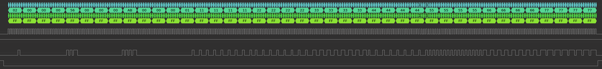
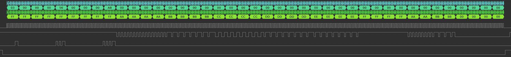

# _SPI Master Example_  

_This example uses the ESP8266 hspi Master to send and receive data to another ESP8266 hspi Slave_

## How to use example  

### Hardware Required  

* Connection:  

| Signal    | Slave  | Master |
|-----------|--------|--------|
| SCLK      | GPIO14 | GPIO14 |
| MISO      | GPIO12 | GPIO12 |
| MOSI      | GPIO13 | GPIO13 |
| CS        | GPIO15 | GPIO15 |
| HANDSHARK | GPIO4  | GPIO4  |
| GND       | GND    | GND    |

* Note:

When the ESP8266 is powered on, it is necessary to keep the GPIO15 low to enter the Flash mode, so the Master and the Slave have different power-on sequences.

```
Master OFF -> Slave ON -> Master ON
```

### Configure the project  

```
make menuconfig
```

* Set serial port under Serial Flasher Options.


### Build and Flash  

Build the project and flash it to the board, then run monitor tool to view serial output:

```
make -j4 flash monitor
```

(To exit the serial monitor, type ``Ctrl-]``.)

See the Getting Started Guide for full steps to configure and use ESP-IDF to build projects.

## Example Output  

* LOG:  

```
I (214) spi_master_example: init gpio
I (216) gpio: GPIO[4]| InputEn: 1| OutputEn: 0| OpenDrain: 0| Pullup: 0| Pulldown: 0| Intr:1 
I (238) spi_master_example: init spi
I (1238) spi_master_example: ------Master read------

I (1231) spi_master_example: addr: 0x0

I (1233) spi_master_example: read_data[0]: 0xaaaaaaaa

I (1249) spi_master_example: read_data[1]: 0xbbbbbbbb

I (1248) spi_master_example: read_data[2]: 0xcccccccc

I (1257) spi_master_example: read_data[3]: 0xdddddddd

I (1266) spi_master_example: read_data[4]: 0xeeeeeeee

I (1275) spi_master_example: read_data[5]: 0xffffffff

I (1284) spi_master_example: read_data[6]: 0xaaaabbbb

I (1293) spi_master_example: read_data[7]: 0x0

I (1301) spi_master_example: ------Master read------

I (1310) spi_master_example: addr: 0x1

I (1317) spi_master_example: read_data[0]: 0xaaaaaaaa

I (1326) spi_master_example: read_data[1]: 0xbbbbbbbb

I (1335) spi_master_example: read_data[2]: 0xcccccccc

I (1344) spi_master_example: read_data[3]: 0xdddddddd

I (1353) spi_master_example: read_data[4]: 0xeeeeeeee

I (1363) spi_master_example: read_data[5]: 0xffffffff

I (1372) spi_master_example: read_data[6]: 0xaaaabbbb

I (1381) spi_master_example: read_data[7]: 0x1

I (1399) spi_master_example: ------Master read------

I (1408) spi_master_example: addr: 0x2

I (1405) spi_master_example: read_data[0]: 0xaaaaaaaa

I (1414) spi_master_example: read_data[1]: 0xbbbbbbbb

I (1423) spi_master_example: read_data[2]: 0xcccccccc

I (1432) spi_master_example: read_data[3]: 0xdddddddd

I (1441) spi_master_example: read_data[4]: 0xeeeeeeee

I (1450) spi_master_example: read_data[5]: 0xffffffff

I (1469) spi_master_example: read_data[6]: 0xaaaabbbb

I (1478) spi_master_example: read_data[7]: 0x2
```

* WAVE FORM:  

  - SPI_MASTER_WRITE_DATA_TO_SLAVE

      

  - SPI_MASTER_READ_DATA_FROM

    