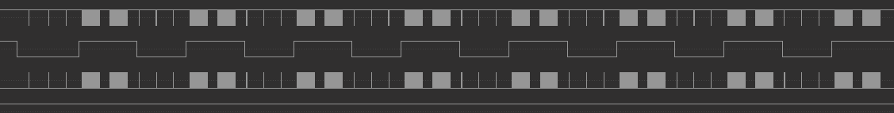

# _SPI OLED Example_  

_This example uses the ESP8266 hspi Master to drive 0.96-inch SPI OLED, and the OLED driver chip is SSD1306._

## How to use example  

### Hardware Required  

* Connection:  

| Signal    | Oled   | ESP8266|
|-----------|--------|--------|
| 3.3V      | VCC    | VCC    |
| SCLK      | D0(SCL)| GPIO14 |
| D/C       | DC     | GPIO12 |
| MOSI      | D1(SDA)| GPIO13 |
| RST       | RES    | GPIO15 |
| CS        | CS     | GND    |
| GND       | GND    | GND    |

### Configure the project  

```
make menuconfig
```

* Set serial port under Serial Flasher Options.


### Build and Flash  

Build the project and flash it to the board, then run monitor tool to view serial output:

```
make -j4 flash monitor
```

(To exit the serial monitor, type ``Ctrl-]``.)

See the Getting Started Guide for full steps to configure and use ESP-IDF to build projects.

## Example Output  

* LOG:  

```
I (233) spi_oled: init gpio
I (235) gpio: GPIO[12]| InputEn: 0| OutputEn: 1| OpenDrain: 0| Pullup: 1| Pulldown: 0| Intr:0
I (239) gpio: GPIO[15]| InputEn: 0| OutputEn: 1| OpenDrain: 0| Pullup: 1| Pulldown: 0| Intr:0
I (251) spi_oled: init hspi
I (257) spi_oled: init oled
```

* WAVE FORM:  

    
