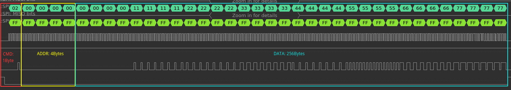
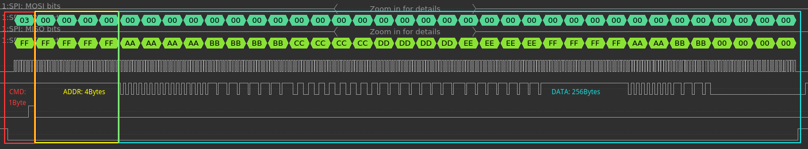

# _SPI Slave Example_  

_This example uses ESP8266 hspi Slave to send and receive data to another ESP8266 hspi Master_

## How to use example  

### Hardware Required  

* Connection:  

| Signal    | Slave  | Master |
|-----------|--------|--------|
| SCLK      | GPIO14 | GPIO14 |
| MISO      | GPIO12 | GPIO12 |
| MOSI      | GPIO13 | GPIO13 |
| CS        | GPIO15 | GPIO15 |
| HANDSHARK | GPIO4  | GPIO4  |
| GND       | GND    | GND    |

* Note:

When the ESP8266 is powered on, it is necessary to keep the GPIO15 low to enter the Flash mode, so the Master and the Slave have different power-on sequences.

```
Master OFF -> Slave ON -> Master ON
```

### Configure the project  

```
make menuconfig
```

* Set serial port under Serial Flasher Options.


### Build and Flash  

Build the project and flash it to the board, then run monitor tool to view serial output:

```
make -j4 flash monitor
```

(To exit the serial monitor, type ``Ctrl-]``.)

See the Getting Started Guide for full steps to configure and use ESP-IDF to build projects.

## Example Output  

* LOG:  

```
I (221) spi_slave_example: init gpio
I (223) gpio: GPIO[4]| InputEn: 0| OutputEn: 1| OpenDrain: 0| Pullup: 0| Pulldown: 0| Intr:0
I (234) spi_slave_example: init spi
I (2516) spi_slave_example: ------Slave read------

I (2519) spi_slave_example: addr: 0x0

I (2511) spi_slave_example: read_data[0]: 0x0

I (2515) spi_slave_example: read_data[1]: 0x11111111

I (2524) spi_slave_example: read_data[2]: 0x22222222

I (2533) spi_slave_example: read_data[3]: 0x33333333

I (2542) spi_slave_example: read_data[4]: 0x44444444

I (2551) spi_slave_example: read_data[5]: 0x55555555

I (2560) spi_slave_example: read_data[6]: 0x66666666

I (2579) spi_slave_example: read_data[7]: 0x77777777

I (2596) spi_slave_example: ------Slave read------

I (2599) spi_slave_example: addr: 0x1

I (2593) spi_slave_example: read_data[0]: 0x1

I (2601) spi_slave_example: read_data[1]: 0x11111111

I (2610) spi_slave_example: read_data[2]: 0x22222222

I (2629) spi_slave_example: read_data[3]: 0x33333333

I (2638) spi_slave_example: read_data[4]: 0x44444444

I (2647) spi_slave_example: read_data[5]: 0x55555555

I (2656) spi_slave_example: read_data[6]: 0x66666666

I (2655) spi_slave_example: read_data[7]: 0x77777777

I (2676) spi_slave_example: ------Slave read------

I (2672) spi_slave_example: addr: 0x2

I (2689) spi_slave_example: read_data[0]: 0x2

I (2697) spi_slave_example: read_data[1]: 0x11111111

I (2706) spi_slave_example: read_data[2]: 0x22222222

I (2705) spi_slave_example: read_data[3]: 0x33333333

I (2714) spi_slave_example: read_data[4]: 0x44444444

I (2723) spi_slave_example: read_data[5]: 0x55555555

I (2732) spi_slave_example: read_data[6]: 0x66666666

I (2741) spi_slave_example: read_data[7]: 0x77777777
```

* WAVE FORM:  

  - SPI_MASTER_WRITE_DATA_TO_SLAVE

      

  - SPI_MASTER_READ_DATA_FROM

    